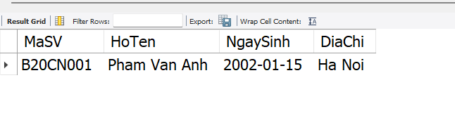
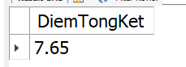
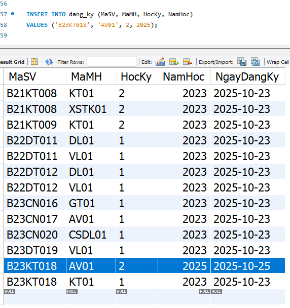

1. PROCEDURE

```bash
DELIMITER $$
CREATE PROCEDURE LayThongTinSinhVien (IN p_MaSV VARCHAR(10))
BEGIN
    SELECT
        MaSV,
        HoTen,
        NgaySinh,
        DiaChi
    FROM
        sinh_vien
    WHERE
        MaSV = p_MaSV;
END$$
DELIMITER ;

```

- Mục đích: Tạo 1 thủ tục lấy thông tin sinh viên theo mã
  Cách dùng: `CALL LayThongTinSinhVien('B20CN001');`



2. FUNCTION

```bash
CREATE FUNCTION TinhDiemTB (p_MaSV VARCHAR(10), p_MaMH VARCHAR(10))
RETURNS DECIMAL(4,2)
BEGIN
    DECLARE v_DiemTB DECIMAL(4,2);
    SELECT
        DiemChuyenCan INTO CC,
        DiemGiuaKy INTO GK,
        DiemCuoiKy INTO CC
    FROM
        diem_so
    WHERE
        MaSV = p_MaSV and MaMH = p_MaMH;
    SET v_DiemTB = CC*0.1+GK*0.3+CC*0.6
    RETURN v_DiemTB
END;
```

- Mục đích: Tạo 1 hàm tính tổng điểm tổng kết của sinh viên dựa theo mã sinh viên và mã môn học
  Cách dùng: `SELECT TinhDiemTB('B20CN001', 'CSDL01') AS DiemTongKet`



3. TRIGGER

```bash
CREATE TRIGGER trg_TuDongSetNgayDangKy
BEFORE INSERT ON dang_ky
FOR EACH ROW
BEGIN
    SET NEW.NgayDangKy = CURDATE();
END;
```

- Mục đích: Tạo 1 Trigger thực hiện nhiệ mvuj tự động điền ngày đăng ký là ngày hiện tại khi một sinh viên đăng ký môn học
  Cách dùng: Khi insert vào bảng dang_ky



4. Transaction

```bash
DELIMITER $$
CREATE PROCEDURE DangKyMonHocCoDieuKien_FIXED (
    IN p_MaSV VARCHAR(10),
    IN p_MaMH_Moi VARCHAR(10),
    IN p_MaMH_TienQuyet VARCHAR(10),
    IN p_HocKy INT,
    IN p_NamHoc YEAR
)
BEGIN
    DECLARE v_TrangThaiTienQuyet VARCHAR(20) DEFAULT NULL;

    DECLARE EXIT HANDLER FOR SQLEXCEPTION
    BEGIN
        ROLLBACK;
        SIGNAL SQLSTATE '45000' SET MESSAGE_TEXT = 'Lỗi Giao dịch SQL';
    END;

    START TRANSACTION;
    IF p_MaMH_TienQuyet IS NOT NULL THEN
        SELECT TrangThai INTO v_TrangThaiTienQuyet
        FROM diem_so
        WHERE MaSV = p_MaSV AND MaMH = p_MaMH_TienQuyet
        ORDER BY NamHoc DESC, HocKy DESC
        LIMIT 1;
    END IF;
    IF v_TrangThaiTienQuyet = 'Dat' THEN
        INSERT INTO dang_ky (MaSV, MaMH, HocKy, NamHoc, NgayDangKy)
        VALUES (p_MaSV, p_MaMH_Moi, p_HocKy, p_NamHoc, CURDATE());
        COMMIT;
    ELSE
        ROLLBACK;
        SIGNAL SQLSTATE '45000' SET MESSAGE_TEXT = 'Lỗi Nghiệp vụ: Sinh viên chưa Đạt môn tiên quyết.';
    END IF;
END$$
DELIMITER ;
```

- Mục đích: Tạo ra 1 chuỗi các thao tác để xử lý việc đăng ký môn. Điều kiện để đăng ký được môn XSTK01 trong kỳ học 2025 đó là sinh viên phải Đạt môn KT01 (Môn tiên quyết)
  Cách sử dụng:
- CALL DangKyMonHocCoDieuKien_FIXED('B21KT009','XSTK01','KT01',4,2025); (trường hợp SV không đủ dk)
- CALL DangKyMonHocCoDieuKien_FIXED('B23KT018','XSTK01','KT01',4,2025); (trường hợp đủ điều kiện)
