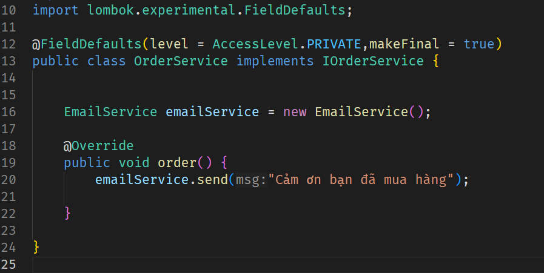
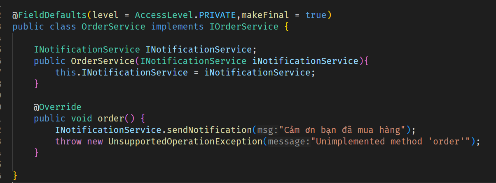

1. Khái niệm
   IoC: Inversion of Control (IoC) là một nguyên tắc thiết kế phần mềm, trong đó quyền kiểm soát luồng hoạt động hoặc quyền tạo/quản lý đối tượng được chuyển giao từ các module code của lập trình viên sang một framework hoặc container chuyên biệt. Thay vì các đối tượng tự tạo ra các đối tượng mà chúng cần, chúng chỉ cần khai báo sự phụ thuộc đó, và framework sẽ "tiêm" (inject) đối tượng cần thiết vào cho chúng. Các đối tượng này đã được Framework(SPring) khởi tạo và lưu sẵn và IoC Container.
   DI: Dependency Injection (DI) là một mẫu thiết kế (design pattern) và là phương pháp phổ biến nhất để hiện thực hóa nguyên tắc IoC. DI xử lý việc tạo ra các đối tượng (gọi là "dependencies") và cung cấp chúng vào các đối tượng cần chúng.
2. Phân tích ví dụ trong code

**Bài toán:** Sau khi Order mặt hàng, hệ thống sẽ gửi email thông báo đến người dùng với nội dung được truyền vào

- Nếu không sử dụng DI
  - Ý tưởng: Tạo một lớp EmailService, trong đó có 1 phương thức là sendMail(String msg) nhận vào một chuỗi thông báo để gửi đến cho người dùng
  - Triển khai: Trong OrderService, sau khi đã đặt hàng xong, gọi đến phương thức sendMail(String msg) của đối tượng emailService

  
**Nhược điểm của cách làm này:** Khiến cho các thành phần trở nên phụ thuộc nhau, khó bảo trì, sửa đổi về lâu dài. Ví dụ về sau thay vì gửi email,khách hàng muốn thay đổi bằng gửi SMS qua điện thoại, khi đó phải sửa tất cả các logic trong phương thức order có liên quan đến EmailService, điều này gây ra rất nhiều khó khăn và rủi ro. Hơn nữa khi tiến hành test, lớp OrderService này luôn tạo ra 1 thể hiện của lớp EmailService. Đôi khi điều này là không cần thiết bởi vì mình chỉ cần kiểm tra logic chính của phương thức order() này, việc gửi email thật là điều không mong muống và không cần thiết

- Khi sử dụng DI
  - Ý tưởng: Tạo 1 interface INotification, trong đó có 1 phương thức là sendNotification(String msg) nhận vào 1 chuỗi thông báo để gửi cho người dùng
  - Triển khai: Trong OrderService, thay vì phải khởi tạo 1 đối tượng mới như lúc nãy. Ta sẽ để cho ứng dụng khởi tạo và lưu trữ nó vào 1 nơi nào đấy (IoC Container), khi chạy ứng dụng. Spring sẽ kiểm tra trong IoC Container và lấy ra đối tượng mà OrderService này cần và cung cấp cho nó.

Cách làm này giúp tách biệt hoàn thành về mặt logic và cấu trúc. Khi chạy ứng dụng, Spring sẽ scan toàn bộ ứng dụng và kiểm tra trong IoC Container để xem lớp nào triển khai INotificationService và cung cấp cho OrderService(trong trường hợp có nhiều lớp triển khai, cần cung cấp thêm thông tin cho Spring biết để có thể Inject đúng Bean, phổ biến nhất có thể kể đến @Qualifider). OrderService chỉ cần gọi đến sendNotification(String msg) của INotification mà không cần khởi tạo như lúc nãy. Nó giúp giải quyết được 2 vấn đề gặp phải phía trên. Nếu khách hàng muốn thay đổi từ gửi email thay vì sms, khi đó chỉ cần thay đổi logic trong lớp triển khai mà không hề động vào logic ban đầu của order. Nó giúp tuân thủ nguyên tắc thứ 2 trong SOLID. Thêm nữa, khi tiến hành viết unit test, ta có thể giả lập (Mock) 1 đối tượng mà không cần tạo mới như lúc nãy để tập trung vào logic chính của hàm đó. Khiến cho việc test trở nên hiệu quả hơn
