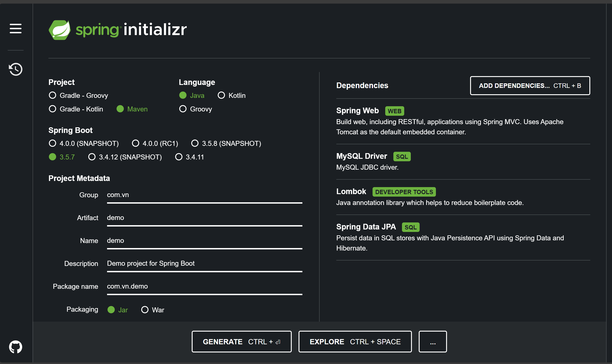

# Phần 1: Framework & Xây dựng RESTful API
## 1.1. Lựa chọn Framework
Lựa chọn Framework SpringBoot <br>
Trong lĩnh vực phát triển Backend với Java, SpringBoot là 1 lựa chọn hàng đầu để xây dựng các ứng dụng dựa trên trên kiến RESTful API. Khác biệt lớn nhất
của nó so với Spring Framework truyền thống là khả năng tự động cấu hình và cung cấp các gói starter dependencies -> Giúp khởi tạo nhanh 1 project mà không cần phải vết hàng trăm dòng
cấu hình XML phức tạp. Nó tích hợp sẵn Tomcat cho phép đóng gói ứng dụng thành 1 file Jar duy nhất và chạy độc lập. Bên cạnh đó nó còn hỗ trợ mạnh cho JPA/Hibernate để quản lý cơ sở dữ liệu
và cung cấp cơ chế DI giúp quản lý các thành phần (Bean) của ứng dụng nhanh, hiệu quả.
## 1.2. Tạo Project & Cấu trúc
- Khởi tạo Project
  

Khi tạo 1 project springboot, cấu trúc thư mục của nó được tổ chức theo quy tắc tiêu chuẩn thường là nằm trong thư mục gốc `src/main/java/{base-package}`.
Một số thu mục phổ biến có thể kể đến giúp tổ chức code logic và dễ bảo trì:
- `controller`: Chứa các lớp controller. Đây là nơi tiếp nhận các yêu cầu HTTP(GET,POST,PUT,DELETE) từ người dùng. Nó sẽ gọi đến lớp Service để xử lý nghiệp và trả về phản hồi dưới dạng JSON
- `service`: Chứa các lớp service. Đây là nơi chứa toàn bộ logic nghiệp vụ của ứng dụng. Nó hoạt động như một lớp trung gian giữa Controller và Repository.
- `repository`: Chứa các repository Interface . Lớp này chịu trách nhiệm giao tiếp trực tiếp với cơ sở dữ liệu.
- `entity`: Chứa các lớp entity. Đây là các đối tượng ánh xạ trực tiếp với bảng trong cơ sở dữ liệu.
- `dto`: Chứa các lớp được dùng để truyền dữ liệu giữa các tầng (thường là giữa Controller và client) hoặc giữa các tầng trong nội bộ ứng dụng, giúp tách biệt đối tượng DB (Entity) khỏi giao diện API.
- `config`: Chứa các lớp Cấu hình (sử dụng @Configuration) cho các thành phần như, cơ sở dữ liệu, message broker, hoặc các Bean tùy chỉnh khác.
- `constant`: Chứa các giá trị hằng số được sử dụng lặp đi lặp lại trong toàn bộ ứng dụng. Việc tập trung các hằng số vào một nơi giúp tránh được lỗi đánh máy và dễ dàng thay đổi giá trị tại một điểm duy nhất.
- `security`: Chứa tất cả các lớp liên quan đến bảo mật và xác thực (Authentication/Authorization) của ứng dụng. Đây thường là nơi cấu hình Spring Security.
- `exception`: Chứa các lớp Exception tùy chỉnh và lớp xử lý Exception toàn cục (Global Exception Handling). Mục tiêu là cung cấp các phản hồi lỗi có ý nghĩa thay vì để Spring Boot trả về lỗi HTML mặc định.
- `annotation`: Chứa các Annotation tùy chỉnh (Custom Annotations) được định nghĩa để thêm chức năng đặc biệt hoặc logic lặp đi lặp lại vào code. Thường được sử dụng kết hợp với AOP (Aspect-Oriented Programming).
- `util`: Cchứa các hàm, lớp hoặc phương thức tiện ích chung, không liên quan trực tiếp đến logic nghiệp vụ , Controller, hay Repository, nhưng được sử dụng lặp đi lặp lại ở nhiều nơi trong ứng dụng. Mục tiêu là để tái sử dụng code và dễ bảo trì sửa đổi về lâu dài

**Cấu trúc thư mục sử dụng trong bài:**

```
main/
├── java/
│   ├── constant            
│   ├── controller          
│   ├── db_fake             
│   ├── dto                 
│   ├── entity              
│   ├── repository          
│   └── service             
└── resources/              
    ├── static              
    ├── templates           
    ├── application.yml     
    └── logback-spring.xml  
```
- **Các file cấu hình** <br>
  Về phần cấu hình, trong Spring sử dụng file application.properties (hoặc application.yml) để định nghĩa các cấu hình các thuộc tính mà ứng dụng cần để hoạt động, từ cấu hình framework đến cấu hình nghiệp vụ. <br>
1. ` application.properties` <br/>
   File cấu hình truyền thống, mặc định của Spring. Cú pháp sử dụng key-value với dấu bằng để phân cách. Mỗi thuộc tính nằm trên 1 dòng riêng biệt. Ví dụ
```
server.port=8080
spring.datasource.url=jdbc:mysql://localhost:3306/my_database
spring.datasource.username=root
spring.datasource.password=12345
```
2. `application.yml`  <br>
   File cấu hình hiện đại hơn, được khuyến khích sử dụng. Cú pháp sử dụng cấu trúc phân cấp dựa trên thụt đầu dòng. Ví dụ <br>
```
server:
  port: 8080
spring:
  datasource:
    url: jdbc:mysql://localhost:3306/my_database
    username: root
    password: 12345
```
**Cấu trúc file cấu hình trong bài sử dụng application.yml**
```
spring:
  application:
    name: Trainning_TYP
  datasource:
    url: ${SPRING_DATASOURCE_URL}
    username: ${SPRING_DATASOURCE_USERNAME}
    password: ${SPRING_DATASOURCE_PASSWORD}
    driver-class-name: ${SPRING_DATASOURCE_DRIVER_CLASS_NAME:com.mysql.cj.jdbc.Driver}
  jpa:
    database: MYSQL
    show-sql: false
    hibernate:
      ddl-auto: update
    properties:
      hibernate:
        dialect: org.hibernate.dialect.MySQL8Dialect

server:
  port: 8080
```

## 1.3. Xây dựng RESTful API cơ bản
- **Khái niệm REST API & HTTP Method** <br>
  REST (Representational State Transfer) là một tập hợp các nguyên tắc kiến trúc để thiết kế các hệ thống mạng, đặc biệt là các dịch vụ web. Một RESTful API cho phép các hệ thống giao tiếp với nhau bằng cách sử dụng các tiêu chuẩn HTTP thông thường.
  Các phương thức HTTP được sử dụng để thể hiện các thao tác CRUD (CREATE, READ, UPDATE, DELETE) lên tài nguyên

|   HTTP Method   | Thao Tác CRUD | Mục Đích  | 
|:---------------:|:-------------:|------------- |
|       GET       | Read (Đọc/Lấy)     |Lấy dữ liệu của một hoặc nhiều tài nguyên.  | 
|      POST       | Create (Tạo)  |Thêm mới một tài nguyên. Dữ liệu được gửi trong Request Body.     | 
|    PUT/PATCH    | Update (Cập nhật)   |Cập nhật một tài nguyên đã tồn tại.    | 
|     DELETE      | Delete (Xóa)  |Xóa một tài nguyên cụ thể.   | 
- **Định nghĩa Routes / Controllers** <br>
  Trong Spring Boot, Controller (sử dụng @RestController) là nơi định nghĩa các Routes (đường dẫn API) và chứa các hàm xử lý yêu cầu HTTP tương ứng.
  Ví dụ về cách định nghĩa 1 API để lấy thông tin danh sách User với đường dẫn: api/user/get-list-user và mapping với HTTP Method tương ứng là GET
```
@RestController
public class UserController{

    GetMapping("/api/user/get-list-user")
    public List<User> getListUser(){
        ...
        return new ResponseEntity(listUser,HttpStatus.OK)
    }
}
```
- **Xử lý Request** <br>
  SpringBoot cung cấp các annotation để dễ dàng trích xuất dữ liệu từ các phần khác nhau của HTTP Request:
    - **Path Variable** (`@PathVariable`): <br>
      Dùng để lấy giá trị từ 1 phần của đường dẫn URL
    ```
    @GetMapping("/users/{id}")
    public User getUser(@PathVariable("id") Long userId) {
        // userId = giá trị của {id} trong URL
    }
    ```
    - **Query Param** (`@RequestParam`): <br>
      Dùng để lấy các tham số được truyền sau dấu ? trên URL. Thường dùng cho tính năng phân trang, lọc, tìm kiếm
    ```
    @GetMapping("/users")
    public List<User> getUsers(
        @RequestParam(defaultValue = "0") int page,
        @RequestParam(defaultValue = "10") int size) {
        // page = 0, size = 10 (hoặc giá trị trong URL)
    }
    ```
    - **Request Body** (`@RequestBody`): <br>
      Dùng để lấy dữ liệu được gửi trong phần thân (Body) của yêu cầu HTTP (thường là JSON hoặc XML), chủ yếu dùng trong các phương thức POST và PUT/PATCH. Spring Boot sẽ tự động chuyển đổi JSON thành đối tượng Java
    ```
    @PostMapping("/products")
    public Product create(@RequestBody ProductDto productPayload) {
        // productPayload chứa dữ liệu JSON từ request body
    }
    ```
- **Xử lý Response** <br>
  Phản hồi của 1 RESTful API tiêu chuẩn phải bao gồm dữ liệu và HTTP Status Code để thông báo trạng thái xử lý cho Frontend. Để xử lý Status Code, có thể sử dụng `RequestEntity` có hỗ trợ sẵn một số mã lỗi:

|   Status Code  | Ý nghĩa | Thường dùng  | 
|:---------------:|:-------------:|------------- |
|       200 - OK       | Yêu cầu đã được xử lý thành công     |GET, PUT, PATCH, DELETE thành công.  | 
|      201 - Created       | Tài nguyên mới đã được tạo thành công.     | POST (khi tạo thành công). |
|   500 - Internal Server Error   | Lỗi xảy ra ở Server.   |Lỗi ngoại lệ không được bắt.   | 

Ví dụ về việc xử lý Response trong Spring:

```
@PostMapping("/products")
public ResponseEntity<Product> createProduct(@RequestBody ProductDto dto) {
    Product newProduct = productService.save(dto);
    return new ResponseEntity<>(newProduct, HttpStatus.CREATED); 
}
```

## 1.4. Thực hành
* Mô tả: Xây dựng 5 API quản lý đối tượng User (id, name, address, gender). Thông tin được lưu trong 1 List trong file db_fake/Data và các thao tác với dữ liệu được triên khai thủ công.
    - `api/v1/user/get-list-user`: Lấy thông tin danh sách User
    - `api/v1/user/get-user-detail/{id}`: Lấy thông tin User theo ID
    - `api/v1/user/add-new-user`: Thêm mới 1 User
    - `api/v1/user/update-user/{id}`: Cập nhật thông tin user theo ID
    - `api/v1/user/delete-user/{id}`: Xóa User theo ID


📂 [Video Demo](https://drive.google.com/file/d/1gIilFvD_-ESUGnchqHuUJ1982V7S6lZ6/view?usp=sharing)

# Phần 2: Tích hợp Database (ORM)

## 2.1. Khái niệm ORM <br>
   ORM - Object Relational Mapping: Là một kỹ thuật cho phép chuyển đổi dữ liệu giữa các hệ thống không tương thích bằng cách sử dụng ngôn ngữ lập trình hướng đối tượng. Hiểu đơn giản, nó giống như 1 thành phần trung gian giữa:
   Thế giới OOP (các Class, Object) - ORM - Thế giới cơ sở dữ liệu (các bảng,hàng,cột,...).
   Thay vì phải viết câu lệnh SQL thuần (raw SQL) thì bây giờ với ORM, chúng ta có thể tương tác với cơ sở dữ liệu thông qua các phương thức của đối tượng Java. ORM thông qua 1 thư viện Hibernate, sẽ tự đọng sinh các câu lệnh SQL cần thiết và chuyển thành các đối tượng Java tương ứng.

## 2.2. Sử dụng ORM theo Framework <br>
   Trong bài này sử dụng Spring Data JPA. Với hệ sinh thái của Java các khái niệm ORM được thực hiện thông qua JPA và Hibernate. JPA là 1 chuẩn về cách mà các ứng dụng Java nên tương tác với các cơ sở dữ liệu quan hệ. Nó định nghĩa các nguyên tắc, không cung cấp logic triển khai. Còn Hibernate là 1 thư viện triển khai phổ biến nhất của đặc  tả JPA. Ví dụ khi sử dụng các annotation như @Entity, @Id, và các API của JPA thực chất là đang sử dụng thư viện Hibernate nằm bên dưới để xư lý logic ORM.<br>
   Còn Spring Data JPA là 1 tầng trừu tượng được xây dựng  trên JPA. Nó giúp giảm thiểu công việc triển khai các thao tác CRUD lặp đi lặp lại. Để cấu hình cần:
- Thêm thư viện `spring-boot-starter-data-jpa` và driver của CSDL
- Cấu hình kết nối db trong file application.yml nói trên <br>
  Một số khái niệm cơ bản khi thao tác với Spring Data JPA
    - `Entity`: nó tương ứng như 1 lớp Java đại diện cho 1 bảng trong CSDL. Ví dụ định nghĩa 1 bảng Product có các thuộc tính (id, name, price)
    ```
    @Entity
    @Table(name = "products")
    public class Product {
        
        @Id
        @GeneratedValue(strategy = GenerationType.IDENTITY)
        private Long id;
        
        private String name;
        
        private double price;
        
        // Getters, Setters, Constructors
    }
    ```
    - `JpaRepository<T,ID>`: Khi định nghĩa 1 interface kế thừa JpaRepository<T,ID> với `T` là loại Entity, `ID` là loại khóa, Spring Data JPA sẽ tự động triển khai tất cả cá phương thức CRUD cơ bản như `save()`, `findById()`, `findAll()`, `delete()`. Nếu muốn custom thêm, cần phải bám theo bộ quy tắc của Spring Data JPA gồm các từ khóa find, by,and,... Ví dụ: tạo 1 phương thức lấy danh sách sản phẩm theo trường tên.
    ```
    import org.springframework.data.jpa.repository.JpaRepository;
    import org.springframework.stereotype.Repository;

    @Repository
    public interface ProductRepository extends JpaRepository<Product, Long> {
        // Spring tự động cung cấp: save(), findById(), findAll(), deleteById(), ...
        // List<Product> findByName(String name);
    }
    ```
    - `Specification`: Giúp xây dựng các truy vấn phức tạp thường dùng trong các tính năng tìm kiếm và lọc.
    ```
    public static Specification<Product> hasNameLike(String name) {
        return (root, query, criteriaBuilder) -> {
            if (name == null || name.isEmpty()) {
                return criteriaBuilder.conjunction(); 
            }
            return criteriaBuilder.like(root.get("name"), "%" + name + "%");
        };
    }
    ```

## 2.3. Thực hành
* Mô tả: Xây dựng 5 API quản lý đối tượng User (id, name, address, gender). Thông tin lúc này được lưu trong database `week_2` và các thao tác với cơ sở dữ liệu được hỗ trợ thông qua Hibernate
    - `api/v1/user/get-list-user`: Lấy thông tin danh sách User
    - `api/v1/user/get-user-detail/{id}`: Lấy thông tin User theo ID
    - `api/v1/user/add-new-user`: Thêm mới 1 User
    - `api/v1/user/update-user/{id}`: Cập nhật thông tin user theo ID
    - `api/v1/user/delete-user/{id}`: Xóa User theo ID

📂 [Video Demo](https://drive.google.com/file/d/1RhwdK3DtQWNi7eWxpfokwwT3yl0FTfS2/view?usp=sharing)

